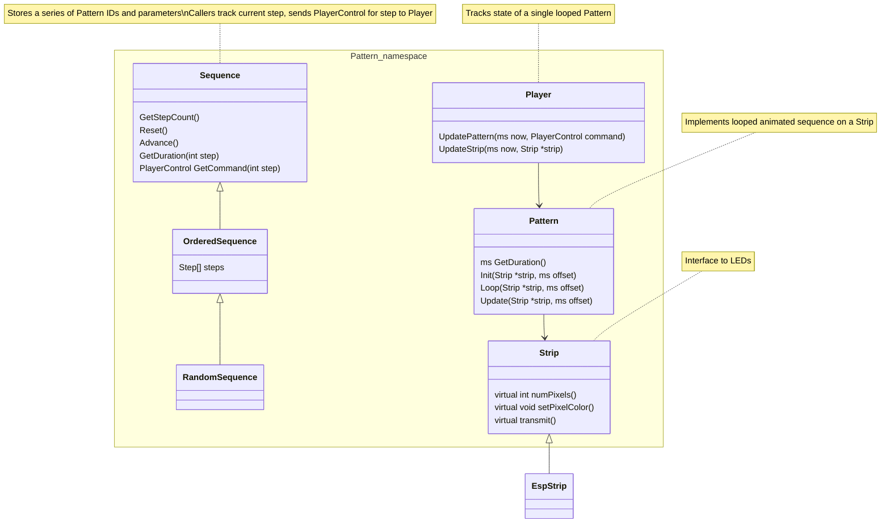

# LightTools Library

## Overview

### Patterns

```mermaid
classDiagram
namespace Pattern_namespace {
class Sequence {
    GetStepCount()
    Reset()
    Advance()
    GetDuration(int step)
    PlayerControl GetCommand(int step)
}
class OrderedSequence {
    Step[] steps
}
class RandomSequence {
    
}
class Player {
    UpdatePattern(ms now, PlayerControl command)
    UpdateStrip(ms now, Strip *strip)    
}
class Pattern {
    ms GetDuration()
    Init(Strip *strip, ms offset)
    Loop(Strip *strip, ms offset)
    Update(Strip *strip, ms offset)
}
class Strip {
    virtual int numPixels()
    virtual void setPixelColor()
    virtual transmit()
}
}
note for Sequence "Stores a series of Pattern IDs and parameters\nCallers track current step, sends PlayerControl for step to Player"
note for Player "Tracks state of a single looped Pattern"
note for Pattern "Implements looped animated sequence on a Strip"
note for Strip "Interface to LEDs"
class EspStrip
Sequence <|-- OrderedSequence
OrderedSequence <|-- RandomSequence
Player --> Pattern
Pattern --> Strip
Strip <|-- EspStrip
```
